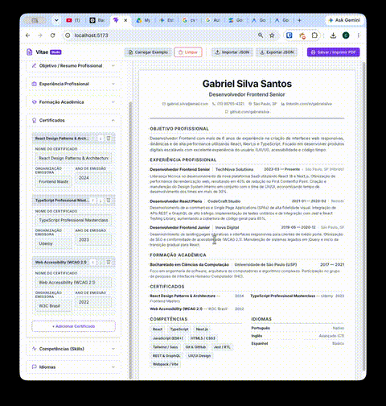

# 📄 Vitae Studio — Construtor de Currículos Profissional

O **Vitae Studio** é uma plataforma web premium, interativa e altamente responsiva para criação de currículos profissionais no padrão cronológico inverso. Desenvolvido com React, Vite e CSS vanilla avançado.

A aplicação combina um editor rico em opções do lado esquerdo com um visualizador em tempo real do lado direito, simulando fielmente uma folha física de papel A4.

---

## 📸 Demonstração da Plataforma



---

## ✨ Principais Funcionalidades

- **Visualização em Tempo Real (WYSIWYG):** Veja o currículo ser atualizado instantaneamente em uma simulação perfeita de folha A4 conforme você digita.
- **Painel Regulável por Arrastar (Drag to Resize):** Alça de redimensionamento divisória interativa que permite regular a largura da barra lateral (de `320px` a `700px`) arrastando com o mouse.
- **Rolagem Isolada Garantida:** A página inteira tem altura travada na tela (viewport). O editor de formulários e a folha de visualização possuem barras de rolagem independentes, evitando scrolls redundantes da página.
- **Modais Customizados Interativos:** Diálogos e confirmações nativas do navegador (`alert`/`confirm`) foram totalmente substituídos por modais elegantes com efeito *glassmorphism* (desfoque de fundo) e animações suaves.
- **Persistência de Progresso (Auto-Save):** Salvamento automático dos dados no `localStorage` do navegador para evitar perda de dados em atualizações de página.
- **Customização Visual Flexível:**
  - **Temas de Layout:** Moderno (cabeçalho centralizado), Clássico (tradicional) e Minimalista (ultra-compacto).
  - **Tipografia:** Escolha entre fontes premium (Inter, Lora e Roboto).
  - **Paleta de Cores:** Ajuste dinâmico da cor de destaque para títulos, links e divisores.
  - **Densidade:** Espaçamento compacto, normal ou espaçoso para acomodar melhor as informações em uma única página.
- **Importação & Exportação JSON:** Salve os dados do seu currículo baixando um arquivo `.json` local e carregue-o de volta quando quiser.
- **Impressão Otimizada (PDF):** Integração com o comando nativo de impressão do navegador (`window.print()`). Utiliza regras CSS `@media print` e `@page` avançadas para ocultar toda a interface de edição e gerar uma folha A4 física ou PDF perfeitamente formatada e com margens corretas.

---

## 🛠️ Tecnologias Utilizadas

- **Core:** React 19 (Hooks, ResizeObserver, Drag Events)
- **Ferramental:** Vite (Fast HMR & Bundling)
- **Estilização:** CSS Vanilla Avançado (Custom Properties, Flexbox, Clamp)
- **Qualidade de Código:** ESLint (Regras rígidas para padrões limpos de código)

---

## 🚀 Como Executar o Projeto Localmente

### 1. Pré-requisitos
Certifique-se de ter o [Node.js](https://nodejs.org/) instalado em sua máquina.

### 2. Clonar o projeto e instalar dependências
Na pasta raiz do projeto, instale os pacotes npm necessários:
```bash
npm install
```

### 3. Iniciar o servidor de desenvolvimento
Execute o comando de desenvolvimento para iniciar a aplicação localmente:
```bash
npm run dev
```
Abra o endereço gerado (normalmente `http://localhost:5173`) no navegador.

### 4. Compilar para produção
Para gerar o build de produção otimizado na pasta `dist`:
```bash
npm run build
```

### 5. Executar o Linter
Para validar as boas práticas de sintaxe e código:
```bash
npm run lint
```
